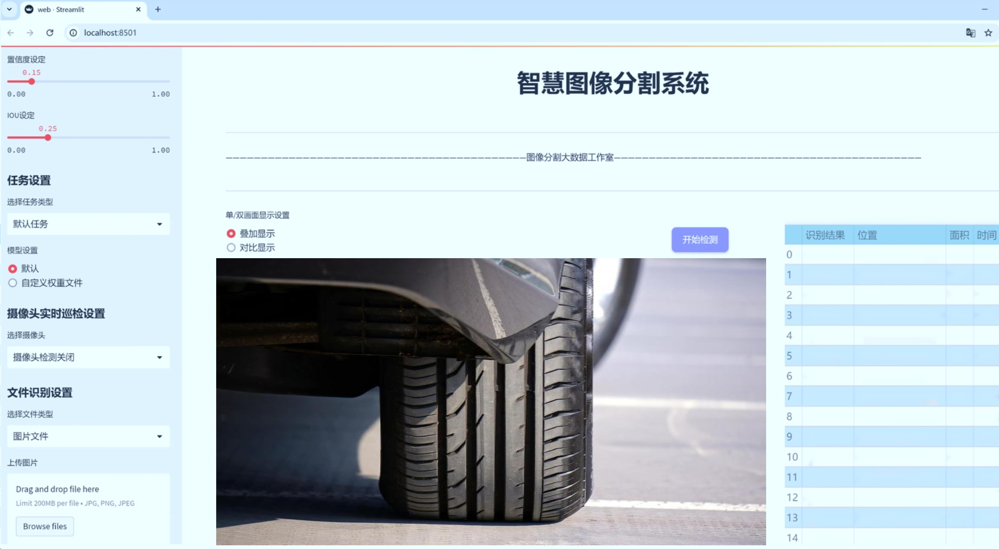
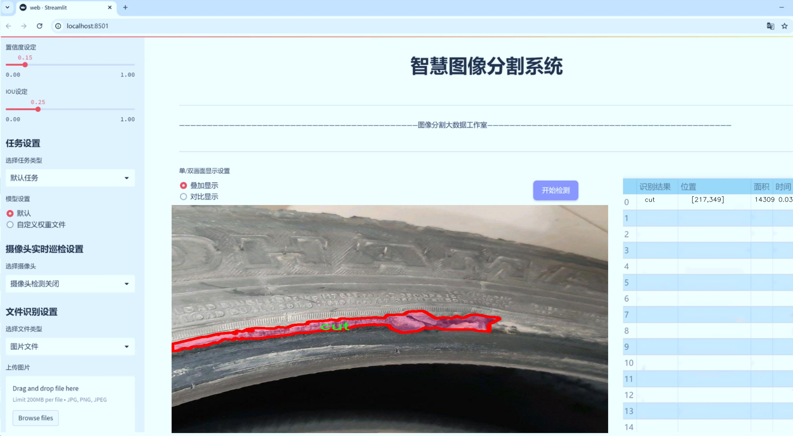
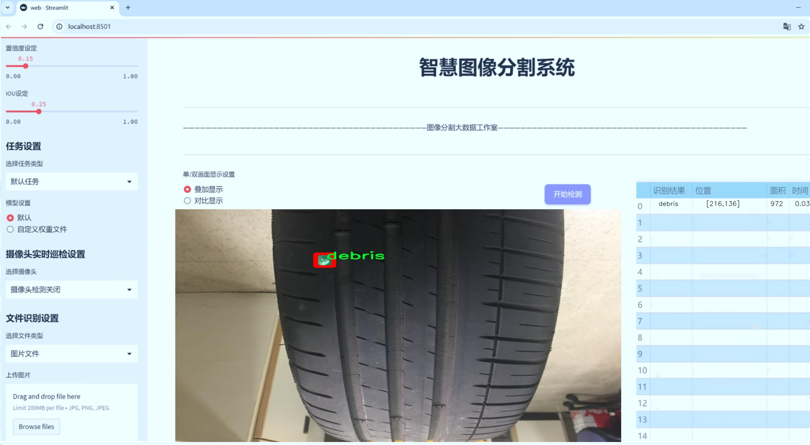
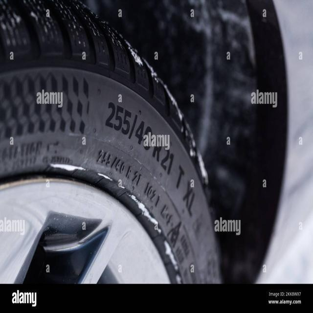
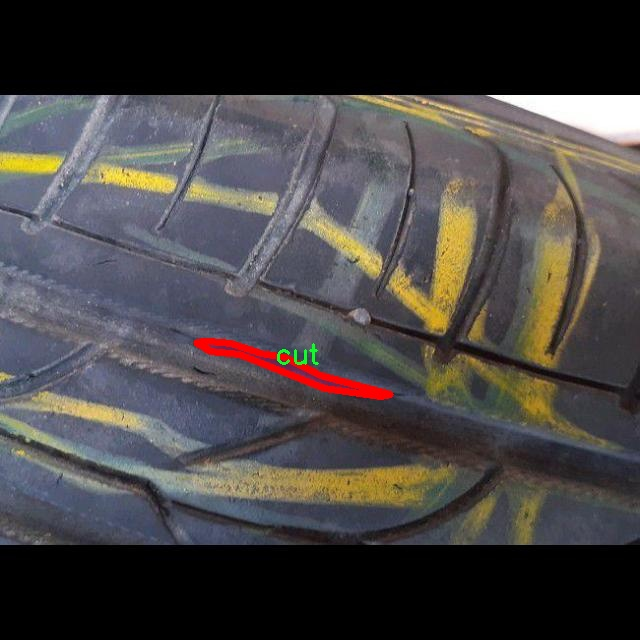
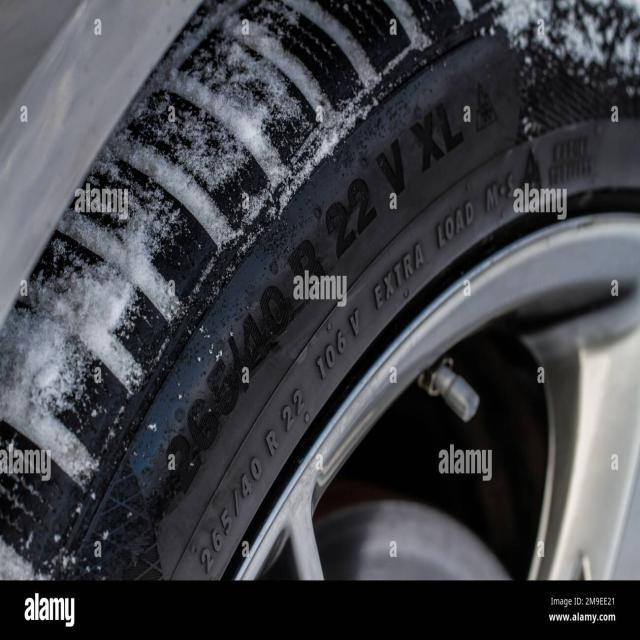
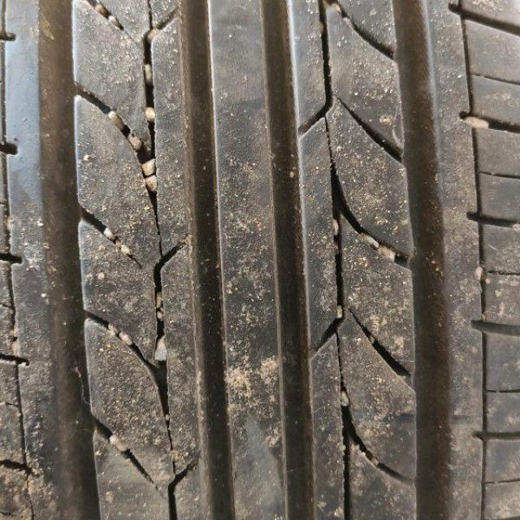
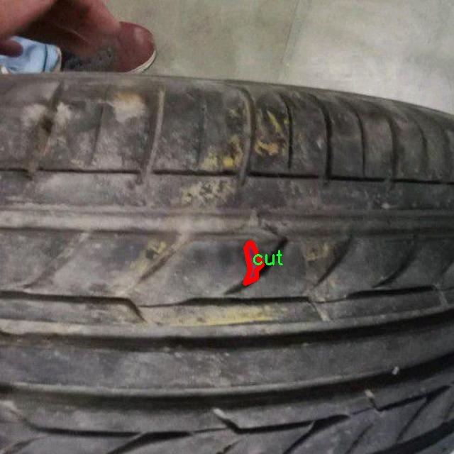

# 轮胎损伤分割系统源码＆数据集分享
 [yolov8-seg-aux＆yolov8-seg-C2f-Faster等50+全套改进创新点发刊_一键训练教程_Web前端展示]

### 1.研究背景与意义

项目参考[ILSVRC ImageNet Large Scale Visual Recognition Challenge](https://gitee.com/YOLOv8_YOLOv11_Segmentation_Studio/projects)

项目来源[AAAI Global Al lnnovation Contest](https://kdocs.cn/l/cszuIiCKVNis)

研究背景与意义

随着汽车工业的快速发展，轮胎作为车辆的关键组成部分，其安全性和性能直接影响到行车安全和驾驶体验。轮胎损伤不仅会导致车辆的行驶不稳定，还可能引发严重的交通事故。因此，及时、准确地检测和评估轮胎损伤情况显得尤为重要。传统的轮胎损伤检测方法主要依赖人工检查，这种方法不仅耗时耗力，而且容易受到人为因素的影响，导致检测结果的不准确性。随着计算机视觉和深度学习技术的不断进步，基于图像处理的自动化检测方法逐渐成为研究的热点。

YOLO（You Only Look Once）系列模型因其高效的实时目标检测能力而受到广泛关注。YOLOv8作为该系列的最新版本，具备了更强的特征提取能力和更快的推理速度，能够在复杂的环境中实现高精度的目标检测。然而，传统的YOLO模型在处理实例分割任务时仍存在一定的局限性，尤其是在细粒度的损伤分类和边界精确分割方面。因此，基于改进YOLOv8的轮胎损伤分割系统的研究具有重要的理论和实际意义。

本研究所使用的数据集“tiredamage 2”包含2200张轮胎损伤图像，涵盖了四种主要损伤类别：切割、碎片、凹陷和磨损。这些类别不仅反映了轮胎在使用过程中可能遇到的常见损伤类型，也为模型的训练和评估提供了丰富的样本基础。通过对这些图像进行实例分割，能够更准确地识别和定位轮胎损伤区域，从而为后续的损伤评估和维修决策提供科学依据。

在此背景下，改进YOLOv8的轮胎损伤分割系统将通过引入更先进的特征提取网络和分割算法，提升模型在轮胎损伤检测中的表现。具体而言，研究将重点关注如何优化模型的损伤特征学习能力，以实现对不同类型损伤的高效分割和分类。同时，针对数据集中的样本不平衡问题，研究将探讨数据增强和迁移学习等技术，以提高模型的泛化能力和鲁棒性。

此外，本研究的成果不仅能够为轮胎损伤检测提供一种新的技术手段，还将推动智能交通和自动驾驶领域的发展。随着智能汽车的普及，实时监测和评估车辆各部件的状态已成为提升行车安全的重要环节。基于改进YOLOv8的轮胎损伤分割系统的应用，能够为智能汽车提供更为精确的轮胎状态监测，进而实现自动预警和维护建议，降低交通事故发生的风险。

综上所述，基于改进YOLOv8的轮胎损伤分割系统的研究，不仅具有重要的学术价值，也具有广泛的应用前景。通过深入探讨轮胎损伤的自动检测与分割技术，将为未来的智能交通系统和自动驾驶技术的安全性提供坚实的技术支撑。

### 2.图片演示







##### 注意：由于此博客编辑较早，上面“2.图片演示”和“3.视频演示”展示的系统图片或者视频可能为老版本，新版本在老版本的基础上升级如下：（实际效果以升级的新版本为准）

  （1）适配了YOLOV8的“目标检测”模型和“实例分割”模型，通过加载相应的权重（.pt）文件即可自适应加载模型。

  （2）支持“图片识别”、“视频识别”、“摄像头实时识别”三种识别模式。

  （3）支持“图片识别”、“视频识别”、“摄像头实时识别”三种识别结果保存导出，解决手动导出（容易卡顿出现爆内存）存在的问题，识别完自动保存结果并导出到tempDir中。

  （4）支持Web前端系统中的标题、背景图等自定义修改，后面提供修改教程。

  另外本项目提供训练的数据集和训练教程,暂不提供权重文件（best.pt）,需要您按照教程进行训练后实现图片演示和Web前端界面演示的效果。

### 3.视频演示

[3.1 视频演示](https://www.bilibili.com/video/BV1NRycYwEEi/)

### 4.数据集信息展示

##### 4.1 本项目数据集详细数据（类别数＆类别名）

nc: 3
names: ['cut', 'debris', 'indentation']


##### 4.2 本项目数据集信息介绍

数据集信息展示

在本研究中，我们采用了名为“tiredamage 2”的数据集，以训练和改进YOLOv8-seg模型，旨在实现高效的轮胎损伤分割系统。该数据集专注于轮胎损伤的不同类型，提供了丰富的图像样本，涵盖了三种主要的损伤类别：切割（cut）、杂物（debris）和凹陷（indentation）。这些类别的选择不仅反映了轮胎在实际使用中可能遭遇的常见损伤类型，也为模型的训练提供了多样化的样本，使其能够更好地适应不同的损伤情况。

“tiredamage 2”数据集的构建经过精心设计，确保了样本的多样性和代表性。每一类损伤均包含大量的图像，这些图像在不同的光照条件、角度和背景下拍摄，力求模拟真实世界中轮胎可能遭遇的各种环境。这种多样性不仅提高了模型的鲁棒性，还增强了其在实际应用中的实用性。通过对这些图像进行标注，数据集为每种损伤类型提供了清晰的边界框和分割掩码，使得YOLOv8-seg模型能够有效地学习到不同损伤的特征。

在数据集的使用过程中，我们特别关注了图像的质量和标注的准确性。每一张图像都经过严格的筛选，以确保其清晰度和可用性。同时，标注团队对每一类损伤进行了详细的讨论和验证，以减少标注误差，确保数据集的高质量。这种高标准的构建过程为后续的模型训练奠定了坚实的基础，使得YOLOv8-seg在处理轮胎损伤分割任务时能够获得更好的性能。

此外，为了进一步提升模型的泛化能力，我们还对数据集进行了数据增强处理。这包括随机裁剪、旋转、翻转和颜色调整等技术，旨在增加模型对不同损伤情况的适应性。通过这些增强技术，我们能够在有限的样本基础上，生成更多的训练样本，从而提升模型的学习效果。

在训练过程中，我们将数据集分为训练集、验证集和测试集，以便于模型的评估和调优。训练集用于模型的训练，验证集用于调整模型参数，而测试集则用于最终的性能评估。通过这种分割方式，我们能够确保模型在未见过的数据上也能保持良好的表现，从而验证其实际应用的可行性。

总之，“tiredamage 2”数据集为改进YOLOv8-seg的轮胎损伤分割系统提供了坚实的基础。通过对数据集的精心设计和高质量的样本选择，我们期望能够训练出一个在实际应用中表现优异的模型，为轮胎损伤的检测和评估提供有效的技术支持。这不仅有助于提升轮胎的安全性和可靠性，也为未来的智能交通系统和自动驾驶技术的发展奠定了基础。











### 5.全套项目环境部署视频教程（零基础手把手教学）

[5.1 环境部署教程链接（零基础手把手教学）](https://www.bilibili.com/video/BV1jG4Ve4E9t/?vd_source=bc9aec86d164b67a7004b996143742dc)


[5.2 安装Python虚拟环境创建和依赖库安装视频教程链接（零基础手把手教学）](https://www.bilibili.com/video/BV1nA4VeYEze/?vd_source=bc9aec86d164b67a7004b996143742dc)

### 6.手把手YOLOV8-seg训练视频教程（零基础小白有手就能学会）

[6.1 手把手YOLOV8-seg训练视频教程（零基础小白有手就能学会）](https://www.bilibili.com/video/BV1cA4VeYETe/?vd_source=bc9aec86d164b67a7004b996143742dc)


按照上面的训练视频教程链接加载项目提供的数据集，运行train.py即可开始训练



     Epoch   gpu_mem       box       obj       cls    labels  img_size
     1/200     0G   0.01576   0.01955  0.007536        22      1280: 100%|██████████| 849/849 [14:42<00:00,  1.04s/it]
               Class     Images     Labels          P          R     mAP@.5 mAP@.5:.95: 100%|██████████| 213/213 [01:14<00:00,  2.87it/s]
                 all       3395      17314      0.994      0.957      0.0957      0.0843

     Epoch   gpu_mem       box       obj       cls    labels  img_size
     2/200     0G   0.01578   0.01923  0.007006        22      1280: 100%|██████████| 849/849 [14:44<00:00,  1.04s/it]
               Class     Images     Labels          P          R     mAP@.5 mAP@.5:.95: 100%|██████████| 213/213 [01:12<00:00,  2.95it/s]
                 all       3395      17314      0.996      0.956      0.0957      0.0845

     Epoch   gpu_mem       box       obj       cls    labels  img_size
     3/200     0G   0.01561    0.0191  0.006895        27      1280: 100%|██████████| 849/849 [10:56<00:00,  1.29it/s]
               Class     Images     Labels          P          R     mAP@.5 mAP@.5:.95: 100%|███████   | 187/213 [00:52<00:00,  4.04it/s]
                 all       3395      17314      0.996      0.957      0.0957      0.0845


### 7.50+种全套YOLOV8-seg创新点代码加载调参视频教程（一键加载写好的改进模型的配置文件）

[7.1 50+种全套YOLOV8-seg创新点代码加载调参视频教程（一键加载写好的改进模型的配置文件）](https://www.bilibili.com/video/BV1Hw4VePEXv/?vd_source=bc9aec86d164b67a7004b996143742dc)

### 8.YOLOV8-seg图像分割算法原理

原始YOLOv8-seg算法原理

YOLOv8-seg算法是YOLO系列模型的最新版本，专注于目标检测与实例分割任务。自2015年YOLO模型首次推出以来，经过多次迭代，YOLOv8在速度、精度和易用性等方面取得了显著的进步，成为计算机视觉领域中的一项重要技术。YOLOv8的设计理念在于实现高效的实时目标检测，同时兼顾复杂场景下的分割精度。其架构由三个主要部分组成：Backbone、Neck和Head，每个部分都在前代模型的基础上进行了优化和改进。

在Backbone部分，YOLOv8采用了C2f模块替代了之前的C3模块。这一变化引入了更多的跳层连接，极大地丰富了梯度流信息，使得模型在训练过程中能够更有效地学习到特征。C2f模块的设计灵感来源于YOLOv7中的ELAN结构，通过这种方式，YOLOv8不仅保持了模型的轻量化，还提升了特征提取的能力。此外，YOLOv8的基础通道数设定为512，并通过ratio参数灵活调整通道数，确保模型在不同任务中的适应性。

Neck部分同样进行了重要的结构调整，所有的C3模块被替换为C2f模块，并且删除了两处上采样之前的卷积连接层。这一改动使得特征融合过程更加高效，减少了计算量，同时提升了特征图的质量，为后续的目标检测和分割任务奠定了坚实的基础。

在Head部分，YOLOv8引入了解耦头的设计思路，分为两个并行的分支，分别用于提取类别和位置特征。这种解耦设计的优势在于，分类任务与定位任务的侧重点不同，前者更关注特征图中类别之间的相似性，而后者则关注边界框与真实框之间的关系。通过这种方式，YOLOv8在训练和推理过程中能够实现更快的收敛速度和更高的预测精度。此外，YOLOv8采用了无锚框结构，直接预测目标的中心位置，并引入了任务对齐学习（TAL）机制，以优化正负样本的区分。这一机制通过分类分数和IOU的高次幂乘积来衡量任务对齐程度，确保模型在分类和定位任务中都能取得良好的效果。

YOLOv8的创新不仅体现在结构上，还包括损失函数的设计。新的损失函数在优化过程中考虑了分类和定位的联合损失，使得模型在处理复杂场景时，能够更好地平衡精度与速度的关系。实验结果表明，YOLOv8在COCO数据集上的表现优于前代模型，尤其是在mAP（mean Average Precision）指标上，显示出更高的检测精度和更快的推理速度。

为了提升模型的鲁棒性，YOLOv8在训练过程中对数据增强策略进行了调整，特别是在最后10个epoch中停止使用Mosaic数据增强，以避免对数据真实分布的破坏。这一策略使得模型在面对真实场景时，能够更好地适应各种复杂情况。

综上所述，YOLOv8-seg算法通过一系列结构上的创新和优化，提升了目标检测与实例分割的性能。其高效的特征提取、灵活的特征融合以及解耦的检测头设计，使得YOLOv8在处理复杂场景时，能够实现实时性与准确性的完美结合。这些特性使得YOLOv8-seg成为当前计算机视觉领域中最具竞争力的模型之一，具有广泛的应用前景和研究价值。随着技术的不断进步，YOLOv8-seg算法有望在更多实际应用中发挥重要作用，为智能监控、自动驾驶、机器人视觉等领域提供强有力的支持。


### 9.系统功能展示（检测对象为举例，实际内容以本项目数据集为准）

图9.1.系统支持检测结果表格显示

  图9.2.系统支持置信度和IOU阈值手动调节

  图9.3.系统支持自定义加载权重文件best.pt(需要你通过步骤5中训练获得)

  图9.4.系统支持摄像头实时识别

  图9.5.系统支持图片识别

  图9.6.系统支持视频识别

  图9.7.系统支持识别结果文件自动保存

  图9.8.系统支持Excel导出检测结果数据


### 10.50+种全套YOLOV8-seg创新点原理讲解（非科班也可以轻松写刊发刊，V11版本正在科研待更新）

#### 10.1 由于篇幅限制，每个创新点的具体原理讲解就不一一展开，具体见下列网址中的创新点对应子项目的技术原理博客网址【Blog】：


[10.1 50+种全套YOLOV8-seg创新点原理讲解链接](https://gitee.com/qunmasj/good)

#### 10.2 部分改进模块原理讲解(完整的改进原理见上图和技术博客链接)【如果此小节的图加载失败可以通过CSDN或者Github搜索该博客的标题访问原始博客，原始博客图片显示正常】
### YOLOv8简介

YOLOv8 是 Ultralytics 公司继 YOLOv5 算法之后开发的下一代算法模型，目前支持图像分类、物体检测和实例分割任务。YOLOv8 是一个 SOTA 模型，它建立在之前YOLO 系列模型的成功基础上，并引入了新的功能和改进，以进一步提升性能和灵活性。具体创新包括：一个新的骨干网络、一个新的 Ancher-Free 检测头和一个新的损失函数，可以在从 CPU 到 GPU 的各种硬件平台上运行。注意到ultralytics 并没有直接将开源库命名为 YOLOv8，而是直接使用 Ultralytics这个单词，原因是Ultralytics这个库的定位是算法框架，而非特指某一个特定算法，其希望这个库不仅仅能够用于 YOLO 系列模型，同时也能支持其他的视觉任务如图像分类、实例分割等。下图画图YOLOv8目标检测算法同其他YOLO系列算法（YOLOv5、6、7）的实验对比图，左边是模型参数量对比，右边是速度对比。


下面两个表分别是YOLOv8和YOLOv5（v7.0版本）官方在 COCO Val 2017 数据集上测试结果，从中看出 YOLOv8 相比 YOLOv5 精度提升大，但是 N/S/M 模型相应的参数量、FLOPS等提高了不少。


#### YOLOv8概述
提供了一个全新的SOTA模型，和YOLOv5一样，基于缩放系数也提供了 N/S/M/L/X 尺度的不同大小模型，用于满足不同场景需求，同时支持图像分类、目标检测、实例分割和姿态检测任务
在骨干网络和Neck部分将YOLOv5的C3结构换成了梯度流更丰富的 C2f 结构，并对不同尺度模型调整了不同的通道数，大幅提升了模型性能；需要注意的是C2f 模块中存在Split等操作对特定硬件部署没有之前那么友好


Head部分换成了目前主流的解耦头结构，将分类和检测头分离，同时也从 Anchor-Based换成了Anchor-Free Loss
计算方面采用了 TaskAlignedAssigner 正样本分配策略，并引入了 Distribution Focal Loss
下图画出YOLOv8目标检测算法的整体结构图


#### YOLOv8模型
YOLOv8目标检测算法的模型配置文件如下：


从配置文件可以看出，YOLOv8与YOLOv5模型最明显的差异是使用C2F模块替换了原来的C3模块，两个模块的结构图下图所示。


另外Head 部分变化最大，从原先的耦合头变成了解耦头，并且从 YOLOv5 的 Anchor-Based 变成了 Anchor-Free。其结构对比图如下所示：

### RepViT简介

近年来，与轻量级卷积神经网络(cnn)相比，轻量级视觉变压器(ViTs)在资源受限的移动设备上表现出了更高的性能和更低的延迟。这种改进通常归功于多头自注意模块，它使模型能够学习全局表示。然而，轻量级vit和轻量级cnn之间的架构差异还没有得到充分的研究。在这项研究中，我们重新审视了轻量级cnn的高效设计，并强调了它们在移动设备上的潜力。通过集成轻量级vit的高效架构选择，我们逐步增强了标准轻量级CNN的移动友好性，特别是MobileNetV3。这就产生了一个新的纯轻量级cnn家族，即RepViT。大量的实验表明，RepViT优于现有的轻型vit，并在各种视觉任务中表现出良好的延迟。在ImageNet上，RepViT在iPhone 12上以近1ms的延迟实现了超过80%的top-1精度，据我们所知，这是轻量级模型的第一次。

#### RepViT简介
轻量级模型研究一直是计算机视觉任务中的一个焦点，其目标是在降低计算成本的同时达到优秀的性能。轻量级模型与资源受限的移动设备尤其相关，使得视觉模型的边缘部署成为可能。在过去十年中，研究人员主要关注轻量级卷积神经网络（CNNs）的设计，提出了许多高效的设计原则，包括可分离卷积 、逆瓶颈结构 、通道打乱 和结构重参数化等，产生了 MobileNets ，ShuffleNets和 RepVGG 等代表性模型。

另一方面，视觉 Transformers（ViTs）成为学习视觉表征的另一种高效方案。与 CNNs 相比，ViTs 在各种计算机视觉任务中表现出了更优越的性能。然而，ViT 模型一般尺寸很大，延迟很高，不适合资源受限的移动设备。因此，研究人员开始探索 ViT 的轻量级设计。许多高效的ViTs设计原则被提出，大大提高了移动设备上 ViTs 的计算效率，产生了EfficientFormers ，MobileViTs等代表性模型。这些轻量级 ViTs 在移动设备上展现出了相比 CNNs 的更强的性能和更低的延迟。

轻量级 ViTs 优于轻量级 CNNs 的原因通常归结于多头注意力模块，该模块使模型能够学习全局表征。然而，轻量级 ViTs 和轻量级 CNNs 在块结构、宏观和微观架构设计方面存在值得注意的差异，但这些差异尚未得到充分研究。这自然引出了一个问题：轻量级 ViTs 的架构选择能否提高轻量级 CNN 的性能？在这项工作中，我们结合轻量级 ViTs 的架构选择，重新审视了轻量级 CNNs 的设计。我们的旨在缩小轻量级 CNNs 与轻量级 ViTs 之间的差距，并强调前者与后者相比在移动设备上的应用潜力。


在 ConvNeXt 中，参考该博客提出的基于 ResNet50 架构的基础上通过严谨的理论和实验分析，最终设计出一个非常优异的足以媲美 Swin-Transformer 的纯卷积神经网络架构。同样地，RepViT也是主要通过将轻量级 ViTs 的架构设计逐步整合到标准轻量级 CNN，即MobileNetV3-L，来对其进行针对性地改造（魔改）。在这个过程中，作者们考虑了不同粒度级别的设计元素，并通过一系列步骤达到优化的目标。


详细优化步骤如下：

#### 训练配方的对齐
论文中引入了一种衡量移动设备上延迟的指标，并将训练策略与现有的轻量级 ViTs 对齐。这一步骤主要是为了确保模型训练的一致性，其涉及两个概念，即延迟度量和训练策略的调整。

#### 延迟度量指标
为了更准确地衡量模型在真实移动设备上的性能，作者选择了直接测量模型在设备上的实际延迟，以此作为基准度量。这个度量方法不同于之前的研究，它们主要通过FLOPs或模型大小等指标优化模型的推理速度，这些指标并不总能很好地反映在移动应用中的实际延迟。

#### 训练策略的对齐
这里，将 MobileNetV3-L 的训练策略调整以与其他轻量级 ViTs 模型对齐。这包括使用 AdamW 优化器-ViTs 模型必备的优化器，进行 5 个 epoch 的预热训练，以及使用余弦退火学习率调度进行 300 个 epoch 的训练。尽管这种调整导致了模型准确率的略微下降，但可以保证公平性。

#### 块设计的优化
基于一致的训练设置，作者们探索了最优的块设计。块设计是 CNN 架构中的一个重要组成部分，优化块设计有助于提高网络的性能。

#### 分离 Token 混合器和通道混合器
这块主要是对 MobileNetV3-L 的块结构进行了改进，分离了令牌混合器和通道混合器。原来的 MobileNetV3 块结构包含一个 1x1 扩张卷积，然后是一个深度卷积和一个 1x1 的投影层，然后通过残差连接连接输入和输出。在此基础上，RepViT 将深度卷积提前，使得通道混合器和令牌混合器能够被分开。为了提高性能，还引入了结构重参数化来在训练时为深度滤波器引入多分支拓扑。最终，作者们成功地在 MobileNetV3 块中分离了令牌混合器和通道混合器，并将这种块命名为 RepViT 块。

#### 降低扩张比例并增加宽度
在通道混合器中，原本的扩张比例是 4，这意味着 MLP 块的隐藏维度是输入维度的四倍，消耗了大量的计算资源，对推理时间有很大的影响。为了缓解这个问题，我们可以将扩张比例降低到 2，从而减少了参数冗余和延迟，使得 MobileNetV3-L 的延迟降低到 0.65ms。随后，通过增加网络的宽度，即增加各阶段的通道数量，Top-1 准确率提高到 73.5%，而延迟只增加到 0.89ms！

#### 宏观架构元素的优化
在这一步，本文进一步优化了MobileNetV3-L在移动设备上的性能，主要是从宏观架构元素出发，包括 stem，降采样层，分类器以及整体阶段比例。通过优化这些宏观架构元素，模型的性能可以得到显著提高。

#### 浅层网络使用卷积提取器
ViTs 通常使用一个将输入图像分割成非重叠补丁的 “patchify” 操作作为 stem。然而，这种方法在训练优化性和对训练配方的敏感性上存在问题。因此，作者们采用了早期卷积来代替，这种方法已经被许多轻量级 ViTs 所采纳。对比之下，MobileNetV3-L 使用了一个更复杂的 stem 进行 4x 下采样。这样一来，虽然滤波器的初始数量增加到24，但总的延迟降低到0.86ms，同时 top-1 准确率提高到 73.9%。

#### 更深的下采样层
在 ViTs 中，空间下采样通常通过一个单独的补丁合并层来实现。因此这里我们可以采用一个单独和更深的下采样层，以增加网络深度并减少由于分辨率降低带来的信息损失。具体地，作者们首先使用一个 1x1 卷积来调整通道维度，然后将两个 1x1 卷积的输入和输出通过残差连接，形成一个前馈网络。此外，他们还在前面增加了一个 RepViT 块以进一步加深下采样层，这一步提高了 top-1 准确率到 75.4%，同时延迟为 0.96ms。

#### 更简单的分类器
在轻量级 ViTs 中，分类器通常由一个全局平均池化层后跟一个线性层组成。相比之下，MobileNetV3-L 使用了一个更复杂的分类器。因为现在最后的阶段有更多的通道，所以作者们将它替换为一个简单的分类器，即一个全局平均池化层和一个线性层，这一步将延迟降低到 0.77ms，同时 top-1 准确率为 74.8%。

#### 整体阶段比例
阶段比例代表了不同阶段中块数量的比例，从而表示了计算在各阶段中的分布。论文选择了一个更优的阶段比例 1:1:7:1，然后增加网络深度到 2:2:14:2，从而实现了一个更深的布局。这一步将 top-1 准确率提高到 76.9%，同时延迟为 1.02 ms。

#### 卷积核大小的选择
众所周知，CNNs 的性能和延迟通常受到卷积核大小的影响。例如，为了建模像 MHSA 这样的远距离上下文依赖，ConvNeXt 使用了大卷积核，从而实现了显著的性能提升。然而，大卷积核对于移动设备并不友好，因为它的计算复杂性和内存访问成本。MobileNetV3-L 主要使用 3x3 的卷积，有一部分块中使用 5x5 的卷积。作者们将它们替换为3x3的卷积，这导致延迟降低到 1.00ms，同时保持了76.9%的top-1准确率。

#### SE 层的位置
自注意力模块相对于卷积的一个优点是根据输入调整权重的能力，这被称为数据驱动属性。作为一个通道注意力模块，SE层可以弥补卷积在缺乏数据驱动属性上的限制，从而带来更好的性能。MobileNetV3-L 在某些块中加入了SE层，主要集中在后两个阶段。然而，与分辨率较高的阶段相比，分辨率较低的阶段从SE提供的全局平均池化操作中获得的准确率提升较小。作者们设计了一种策略，在所有阶段以交叉块的方式使用SE层，从而在最小的延迟增量下最大化准确率的提升，这一步将top-1准确率提升到77.4%，同时延迟降低到0.87ms。

注意！【这一点其实百度在很早前就已经做过实验比对得到过这个结论了，SE 层放置在靠近深层的地方效果好】

#### 微观设计的调整
RepViT 通过逐层微观设计来调整轻量级 CNN，这包括选择合适的卷积核大小和优化挤压-激励（Squeeze-and-excitation，简称SE）层的位置。这两种方法都能显著改善模型性能。

#### 网络架构
最终，通过整合上述改进策略，我们便得到了模型RepViT的整体架构，该模型有多个变种，例如RepViT-M1/M2/M3。同样地，不同的变种主要通过每个阶段的通道数和块数来区分。


### 11.项目核心源码讲解（再也不用担心看不懂代码逻辑）

#### 11.1 ultralytics\nn\__init__.py

以下是对代码的核心部分进行提炼和详细注释的结果：

```python
# Ultralytics YOLO 🚀, AGPL-3.0 license

# 从tasks模块中导入必要的类和函数
from .tasks import (
    BaseModel,            # 基础模型类，其他模型类的基类
    ClassificationModel,  # 分类模型类
    DetectionModel,       # 检测模型类
    SegmentationModel,    # 分割模型类
    attempt_load_one_weight,  # 尝试加载单个权重文件的函数
    attempt_load_weights,     # 尝试加载多个权重文件的函数
    guess_model_scale,        # 猜测模型的缩放比例的函数
    guess_model_task,         # 猜测模型任务类型的函数
    parse_model,              # 解析模型结构的函数
    torch_safe_load,          # 安全加载PyTorch模型的函数
    yaml_model_load           # 从YAML文件加载模型的函数
)

# 定义模块的公开接口，允许用户从该模块导入这些名称
__all__ = (
    'attempt_load_one_weight',  # 允许导入的函数
    'attempt_load_weights',      # 允许导入的函数
    'parse_model',               # 允许导入的函数
    'yaml_model_load',           # 允许导入的函数
    'guess_model_task',          # 允许导入的函数
    'guess_model_scale',         # 允许导入的函数
    'torch_safe_load',           # 允许导入的函数
    'DetectionModel',            # 允许导入的类
    'SegmentationModel',         # 允许导入的类
    'ClassificationModel',       # 允许导入的类
    'BaseModel'                  # 允许导入的类
)
```

### 代码分析与注释

1. **导入模块**：
   - 代码从`.tasks`模块中导入了一系列的类和函数，这些类和函数都是与模型相关的，主要用于处理不同类型的模型（如分类、检测、分割等）。

2. **核心类**：
   - `BaseModel`：作为所有模型的基类，提供了模型的基本功能和接口。
   - `ClassificationModel`、`DetectionModel`、`SegmentationModel`：分别代表分类、检测和分割模型的实现。

3. **核心函数**：
   - `attempt_load_one_weight`：用于尝试加载单个权重文件，通常用于初始化模型。
   - `attempt_load_weights`：用于加载多个权重文件，适用于模型的训练或推理。
   - `guess_model_scale`：根据输入信息猜测模型的缩放比例，可能用于调整模型的复杂度。
   - `guess_model_task`：根据模型的特征猜测其任务类型（分类、检测或分割）。
   - `parse_model`：解析模型的结构，通常用于构建模型的计算图。
   - `torch_safe_load`：安全地加载PyTorch模型，避免因版本不兼容导致的问题。
   - `yaml_model_load`：从YAML配置文件中加载模型的配置，便于模型的灵活配置和管理。

4. **模块接口**：
   - `__all__`变量定义了模块的公开接口，用户在使用`from module import *`时，只能导入这些指定的名称。这有助于隐藏内部实现细节，只暴露必要的功能给用户。

这个文件是Ultralytics YOLO项目中的一个初始化文件，通常用于定义模块的公共接口。在文件的开头，首先有一个注释，表明这是Ultralytics YOLO项目，并且该项目遵循AGPL-3.0许可证。

接下来，文件通过相对导入的方式引入了一些模型和功能。这些导入的内容包括不同类型的模型类，如基础模型（BaseModel）、分类模型（ClassificationModel）、检测模型（DetectionModel）和分割模型（SegmentationModel）。此外，还引入了一些与模型加载和解析相关的函数，例如尝试加载单个权重（attempt_load_one_weight）、尝试加载权重（attempt_load_weights）、猜测模型的规模（guess_model_scale）、猜测模型的任务（guess_model_task）、解析模型（parse_model）、安全加载PyTorch模型（torch_safe_load）以及从YAML文件加载模型（yaml_model_load）。

最后，使用`__all__`变量定义了该模块的公共接口，列出了可以被外部访问的名称。这意味着，当使用`from ultralytics.nn import *`这种方式导入时，只会导入`__all__`中列出的内容，从而控制了模块的可见性和使用方式。

总体来说，这个文件的主要作用是组织和暴露Ultralytics YOLO项目中与模型相关的功能和类，方便其他模块或用户进行调用和使用。

#### 11.2 ultralytics\cfg\__init__.py

以下是代码中最核心的部分，并附上详细的中文注释：

```python
def cfg2dict(cfg):
    """
    将配置对象转换为字典格式，可以是文件路径、字符串或SimpleNamespace对象。

    参数:
        cfg (str | Path | dict | SimpleNamespace): 要转换为字典的配置对象。

    返回:
        cfg (dict): 转换后的字典格式配置对象。
    """
    if isinstance(cfg, (str, Path)):
        cfg = yaml_load(cfg)  # 从文件加载字典
    elif isinstance(cfg, SimpleNamespace):
        cfg = vars(cfg)  # 将SimpleNamespace转换为字典
    return cfg


def get_cfg(cfg: Union[str, Path, Dict, SimpleNamespace] = DEFAULT_CFG_DICT, overrides: Dict = None):
    """
    从文件或字典加载并合并配置数据。

    参数:
        cfg (str | Path | Dict | SimpleNamespace): 配置数据。
        overrides (str | Dict | optional): 覆盖的配置，可以是文件名或字典。默认为None。

    返回:
        (SimpleNamespace): 训练参数的命名空间。
    """
    cfg = cfg2dict(cfg)

    # 合并覆盖的配置
    if overrides:
        overrides = cfg2dict(overrides)
        if 'save_dir' not in cfg:
            overrides.pop('save_dir', None)  # 忽略特殊的覆盖键
        check_dict_alignment(cfg, overrides)  # 检查配置一致性
        cfg = {**cfg, **overrides}  # 合并cfg和overrides字典（优先使用overrides）

    # 特殊处理数字类型的项目名称
    for k in 'project', 'name':
        if k in cfg and isinstance(cfg[k], (int, float)):
            cfg[k] = str(cfg[k])  # 将数字转换为字符串
    if cfg.get('name') == 'model':  # 将模型名称赋值给'name'参数
        cfg['name'] = cfg.get('model', '').split('.')[0]
        LOGGER.warning(f"WARNING ⚠️ 'name=model' 自动更新为 'name={cfg['name']}'.")

    # 类型和值检查
    for k, v in cfg.items():
        if v is not None:  # None值可能来自可选参数
            if k in CFG_FLOAT_KEYS and not isinstance(v, (int, float)):
                raise TypeError(f"'{k}={v}' 的类型 {type(v).__name__} 无效. "
                                f"有效的 '{k}' 类型是 int（例如 '{k}=0'）或 float（例如 '{k}=0.5'）")
            elif k in CFG_FRACTION_KEYS:
                if not isinstance(v, (int, float)):
                    raise TypeError(f"'{k}={v}' 的类型 {type(v).__name__} 无效. "
                                    f"有效的 '{k}' 类型是 int（例如 '{k}=0'）或 float（例如 '{k}=0.5'）")
                if not (0.0 <= v <= 1.0):
                    raise ValueError(f"'{k}={v}' 的值无效. "
                                     f"有效的 '{k}' 值在 0.0 到 1.0 之间.")
            elif k in CFG_INT_KEYS and not isinstance(v, int):
                raise TypeError(f"'{k}={v}' 的类型 {type(v).__name__} 无效. "
                                f"'{k}' 必须是 int（例如 '{k}=8'）")
            elif k in CFG_BOOL_KEYS and not isinstance(v, bool):
                raise TypeError(f"'{k}={v}' 的类型 {type(v).__name__} 无效. "
                                f"'{k}' 必须是 bool（例如 '{k}=True' 或 '{k}=False'）")

    # 返回命名空间实例
    return IterableSimpleNamespace(**cfg)


def entrypoint(debug=''):
    """
    这是Ultralytics包的入口点，负责解析传递给包的命令行参数。

    该函数允许：
    - 传递必需的YOLO参数作为字符串列表
    - 指定要执行的任务，例如'detect'、'segment'或'classify'
    - 指定模式，例如'train'、'val'、'test'或'predict'
    - 运行特殊模式，如'checks'
    - 向包的配置传递覆盖参数

    它使用包的默认配置并使用传递的覆盖参数进行初始化。
    然后调用带有组合配置的CLI函数。
    """
    args = (debug.split(' ') if debug else sys.argv)[1:]  # 获取命令行参数
    if not args:  # 如果没有参数传递
        LOGGER.info(CLI_HELP_MSG)  # 输出帮助信息
        return

    # 定义特殊命令
    special = {
        'help': lambda: LOGGER.info(CLI_HELP_MSG),
        'checks': checks.collect_system_info,
        'version': lambda: LOGGER.info(__version__),
        'settings': lambda: handle_yolo_settings(args[1:]),
        'cfg': lambda: yaml_print(DEFAULT_CFG_PATH),
        'hub': lambda: handle_yolo_hub(args[1:]),
        'login': lambda: handle_yolo_hub(args),
        'copy-cfg': copy_default_cfg
    }
    
    # 合并参数并处理
    # ... 省略处理逻辑 ...

    # 运行命令
    getattr(model, mode)(**overrides)  # 使用模型的默认参数运行命令

    # 显示帮助信息
    LOGGER.info(f'💡 了解更多信息请访问 https://docs.ultralytics.com/modes/{mode}')
```

### 代码核心部分说明：
1. **cfg2dict**: 将配置对象转换为字典格式，支持多种输入类型（字符串、路径、字典、SimpleNamespace）。
2. **get_cfg**: 加载和合并配置数据，进行类型和值的检查，确保配置的有效性。
3. **entrypoint**: 作为程序的入口，解析命令行参数，处理特殊命令，执行相应的模型操作，并输出帮助信息。

这些函数是程序的核心，负责配置的加载、验证和命令行参数的处理。

这个程序文件是Ultralytics YOLO（You Only Look Once）模型的配置和命令行接口（CLI）处理代码。它主要负责解析用户输入的命令行参数，加载和合并配置文件，并根据不同的任务和模式执行相应的操作。

首先，文件中定义了一些有效的任务和模式，包括训练（train）、验证（val）、预测（predict）、导出（export）、跟踪（track）和基准测试（benchmark）。同时，它还定义了不同任务对应的数据集、模型和评估指标的映射关系。

接下来，CLI_HELP_MSG字符串提供了命令行使用的帮助信息，详细说明了如何使用YOLO命令，包括各个任务和模式的示例。

在程序中，cfg2dict函数用于将配置对象转换为字典格式，以便后续处理。get_cfg函数则负责加载和合并配置数据，并进行类型和数值的检查，确保传入的参数符合预期的格式和范围。

get_save_dir函数用于根据训练、验证或预测的参数生成保存目录。_handle_deprecation函数处理已弃用的配置键，确保向后兼容性。check_dict_alignment函数检查自定义配置与基础配置之间的键是否匹配，并提供相似键的建议。

merge_equals_args函数合并参数列表中的等号分隔的参数，确保解析时的正确性。handle_yolo_hub和handle_yolo_settings函数分别处理与Ultralytics HUB和YOLO设置相关的命令行参数。

entrypoint函数是程序的入口点，负责解析命令行参数并根据不同的任务和模式调用相应的功能。它会检查参数的有效性，设置默认值，并最终调用模型的相应方法执行任务。

在文件的最后，copy_default_cfg函数提供了一个功能，用于复制默认配置文件并创建一个新的配置文件，方便用户进行自定义设置。

总的来说，这个文件是Ultralytics YOLO模型的核心配置和命令行接口处理部分，确保用户能够方便地使用不同的功能和配置进行模型训练、验证和推理。

#### 11.3 ultralytics\trackers\byte_tracker.py

以下是经过简化并添加详细中文注释的核心代码部分：

```python
import numpy as np
from .basetrack import BaseTrack, TrackState
from .utils import matching
from .utils.kalman_filter import KalmanFilterXYAH

class STrack(BaseTrack):
    """
    单目标跟踪表示，使用卡尔曼滤波进行状态估计。

    该类负责存储单个轨迹的信息，并基于卡尔曼滤波进行状态更新和预测。
    """

    shared_kalman = KalmanFilterXYAH()  # 共享的卡尔曼滤波器实例

    def __init__(self, tlwh, score, cls):
        """初始化新的STrack实例。"""
        # 将边界框的tlwh格式转换为tlwh格式并存储
        self._tlwh = np.asarray(self.tlbr_to_tlwh(tlwh[:-1]), dtype=np.float32)
        self.kalman_filter = None  # 卡尔曼滤波器实例
        self.mean, self.covariance = None, None  # 状态均值和协方差
        self.is_activated = False  # 轨迹是否被激活的标志

        self.score = score  # 置信度分数
        self.tracklet_len = 0  # 轨迹长度
        self.cls = cls  # 目标类别
        self.idx = tlwh[-1]  # 目标索引

    def predict(self):
        """使用卡尔曼滤波器预测目标的下一个状态。"""
        mean_state = self.mean.copy()  # 复制当前均值状态
        if self.state != TrackState.Tracked:  # 如果状态不是被跟踪状态
            mean_state[7] = 0  # 将速度设置为0
        # 使用卡尔曼滤波器进行预测
        self.mean, self.covariance = self.kalman_filter.predict(mean_state, self.covariance)

    def activate(self, kalman_filter, frame_id):
        """激活新的轨迹。"""
        self.kalman_filter = kalman_filter  # 设置卡尔曼滤波器
        self.track_id = self.next_id()  # 获取下一个轨迹ID
        # 初始化卡尔曼滤波器的状态
        self.mean, self.covariance = self.kalman_filter.initiate(self.convert_coords(self._tlwh))

        self.tracklet_len = 0  # 重置轨迹长度
        self.state = TrackState.Tracked  # 设置状态为被跟踪
        if frame_id == 1:
            self.is_activated = True  # 如果是第一帧，激活轨迹
        self.frame_id = frame_id  # 当前帧ID
        self.start_frame = frame_id  # 轨迹开始帧

    def update(self, new_track, frame_id):
        """
        更新匹配轨迹的状态。

        参数:
            new_track (STrack): 包含更新信息的新轨迹。
            frame_id (int): 当前帧的ID。
        """
        self.frame_id = frame_id  # 更新当前帧ID
        self.tracklet_len += 1  # 增加轨迹长度

        new_tlwh = new_track.tlwh  # 获取新的边界框
        # 使用卡尔曼滤波器更新状态
        self.mean, self.covariance = self.kalman_filter.update(self.mean, self.covariance,
                                                               self.convert_coords(new_tlwh))
        self.state = TrackState.Tracked  # 设置状态为被跟踪
        self.is_activated = True  # 激活轨迹

        self.score = new_track.score  # 更新置信度分数
        self.cls = new_track.cls  # 更新目标类别
        self.idx = new_track.idx  # 更新目标索引

    @property
    def tlwh(self):
        """获取当前边界框位置（左上角x, 左上角y, 宽度, 高度）。"""
        if self.mean is None:
            return self._tlwh.copy()  # 如果均值状态为空，返回初始值
        ret = self.mean[:4].copy()  # 复制均值状态的前四个值
        ret[2] *= ret[3]  # 计算宽度
        ret[:2] -= ret[2:] / 2  # 计算左上角坐标
        return ret

    @staticmethod
    def tlwh_to_xyah(tlwh):
        """将边界框转换为格式（中心x, 中心y, 宽高比, 高度）。"""
        ret = np.asarray(tlwh).copy()  # 复制输入的tlwh
        ret[:2] += ret[2:] / 2  # 计算中心坐标
        ret[2] /= ret[3]  # 计算宽高比
        return ret
```

### 代码说明：
1. **STrack类**：用于表示单个目标的跟踪状态，使用卡尔曼滤波器进行状态预测和更新。
2. **初始化方法**：接收边界框信息、置信度和类别，初始化跟踪状态。
3. **预测方法**：根据当前状态使用卡尔曼滤波器预测下一个状态。
4. **激活方法**：激活新的轨迹，初始化卡尔曼滤波器的状态。
5. **更新方法**：根据新的检测信息更新轨迹状态。
6. **属性方法**：提供当前边界框的tlwh格式和转换为xyah格式的方法。

这段代码的核心功能是实现单目标跟踪，利用卡尔曼滤波器来预测和更新目标的状态。

这个程序文件实现了一个基于YOLOv8的目标跟踪算法，主要包含两个类：`STrack`和`BYTETracker`。`STrack`类用于表示单个目标的跟踪状态，使用卡尔曼滤波器进行状态估计。它负责存储与个别跟踪相关的所有信息，并根据卡尔曼滤波器进行状态更新和预测。该类的属性包括共享的卡尔曼滤波器、边界框的坐标和尺寸、状态估计的均值和协方差、激活状态、置信度分数、跟踪长度、类别标签、索引和当前帧ID等。它还提供了一系列方法用于预测、激活、更新和坐标转换等功能。

`BYTETracker`类则是整个跟踪算法的核心，负责初始化、更新和管理视频序列中检测到的目标的跟踪。它维护着被跟踪、丢失和移除的轨迹状态，利用卡尔曼滤波器预测目标的新位置，并执行数据关联。该类的属性包括成功激活的跟踪列表、丢失的跟踪列表、移除的跟踪列表、当前帧ID、命令行参数、最大丢失时间和卡尔曼滤波器对象等。它的主要方法包括更新跟踪器、获取卡尔曼滤波器、初始化跟踪、计算轨迹与检测之间的距离、预测轨迹、重置ID、合并和过滤轨迹等。

在`update`方法中，算法首先增加当前帧ID，然后根据检测结果更新目标的跟踪状态。它会对检测结果进行筛选，分为高分和低分的检测框，并分别进行处理。通过计算轨迹与检测之间的距离，使用匈牙利算法进行匹配，更新已跟踪的目标。如果目标丢失，则将其标记为丢失，并在达到最大丢失时间后将其移除。最后，更新当前的跟踪状态，返回激活的目标的边界框信息。

整体来看，这个文件实现了一个高效的目标跟踪系统，结合了卡尔曼滤波和YOLOv8的目标检测能力，能够在视频序列中实时跟踪多个目标。

#### 11.4 ultralytics\utils\callbacks\dvc.py

以下是经过简化和注释的核心代码部分：

```python
# 导入必要的库
from ultralytics.utils import LOGGER, SETTINGS, TESTS_RUNNING, checks

try:
    # 确保当前不是在测试环境中
    assert not TESTS_RUNNING  
    # 确保DVC集成已启用
    assert SETTINGS['dvc'] is True  
    import dvclive  # 导入DVC Live库
    # 检查DVC Live版本
    assert checks.check_version('dvclive', '2.11.0', verbose=True)

    import os
    import re
    from pathlib import Path

    # 初始化DVC Live日志实例
    live = None
    _processed_plots = {}  # 存储已处理的图表

    # 训练周期标志，区分最终评估和最后一次验证
    _training_epoch = False

except (ImportError, AssertionError, TypeError):
    dvclive = None  # 如果导入失败，则将dvclive设置为None


def _log_images(path, prefix=''):
    """记录指定路径的图像，带有可选前缀。"""
    if live:  # 如果DVC Live实例存在
        name = path.name
        # 根据批次分组图像，以便在UI中启用滑块
        m = re.search(r'_batch(\d+)', name)
        if m:
            ni = m[1]
            new_stem = re.sub(r'_batch(\d+)', '_batch', path.stem)
            name = (Path(new_stem) / ni).with_suffix(path.suffix)

        # 记录图像
        live.log_image(os.path.join(prefix, name), path)


def on_train_epoch_start(trainer):
    """在每个训练周期开始时设置_training_epoch为True。"""
    global _training_epoch
    _training_epoch = True


def on_fit_epoch_end(trainer):
    """在每个训练周期结束时记录训练指标和模型信息。"""
    global _training_epoch
    if live and _training_epoch:  # 如果DVC Live实例存在且当前为训练周期
        # 收集所有指标
        all_metrics = {**trainer.label_loss_items(trainer.tloss, prefix='train'), **trainer.metrics, **trainer.lr}
        for metric, value in all_metrics.items():
            live.log_metric(metric, value)  # 记录每个指标

        # 记录训练和验证的图表
        _log_plots(trainer.plots, 'train')
        _log_plots(trainer.validator.plots, 'val')

        live.next_step()  # 进入下一步
        _training_epoch = False  # 重置训练周期标志


def on_train_end(trainer):
    """在训练结束时记录最佳指标和混淆矩阵。"""
    if live:  # 如果DVC Live实例存在
        # 记录最佳指标
        all_metrics = {**trainer.label_loss_items(trainer.tloss, prefix='train'), **trainer.metrics, **trainer.lr}
        for metric, value in all_metrics.items():
            live.log_metric(metric, value, plot=False)

        # 记录验证图表和混淆矩阵
        _log_plots(trainer.plots, 'val')
        _log_confusion_matrix(trainer.validator)

        live.end()  # 结束DVC Live记录


# 定义回调函数字典
callbacks = {
    'on_train_epoch_start': on_train_epoch_start,
    'on_fit_epoch_end': on_fit_epoch_end,
    'on_train_end': on_train_end} if dvclive else {}
```

### 代码说明：
1. **导入部分**：导入了Ultralytics YOLO所需的库和模块，并进行了一些基础的检查。
2. **DVC Live 初始化**：尝试初始化DVC Live日志实例，并设置一些全局变量以管理图像和图表的记录。
3. **图像记录函数**：`_log_images`函数用于记录图像，支持根据批次分组以便于在UI中展示。
4. **训练周期回调**：定义了在训练周期开始、结束时的回调函数，记录训练过程中的指标和图表。
5. **回调字典**：根据DVC Live的可用性定义回调函数字典，以便在训练过程中调用相应的记录函数。

这个程序文件 `ultralytics/utils/callbacks/dvc.py` 是一个用于集成 DVCLive 日志记录的回调模块，主要用于在训练过程中记录和可视化模型的训练进度和性能指标。代码中首先导入了一些必要的模块和库，并进行了基本的错误处理，以确保在运行时不会出现问题。

文件中定义了一个 `live` 变量，用于存储 DVCLive 的实例，以及一个 `_processed_plots` 字典，用于跟踪已经处理过的绘图数据。接下来，代码中定义了一些私有函数，分别用于记录图像、绘图和混淆矩阵。

`_log_images` 函数用于记录指定路径下的图像，并可以选择性地添加前缀。它会根据图像名称中的批次信息进行分组，以便在用户界面中启用滑块功能。`_log_plots` 函数则用于记录训练过程中的绘图，如果绘图尚未被处理过，则会调用 `_log_images` 进行记录。`_log_confusion_matrix` 函数用于记录混淆矩阵，它会从验证器中提取目标和预测值，并使用 DVCLive 记录这些信息。

接下来的几个函数分别在不同的训练阶段被调用。`on_pretrain_routine_start` 函数在预训练开始时初始化 DVCLive 日志记录器，并记录相关信息。`on_pretrain_routine_end` 函数在预训练结束时记录训练过程中的绘图。`on_train_start` 函数在训练开始时记录训练参数。`on_train_epoch_start` 函数在每个训练周期开始时设置一个全局变量，表示当前正在进行训练周期。

`on_fit_epoch_end` 函数在每个训练周期结束时记录训练指标和模型信息，并调用 `_log_plots` 函数记录训练和验证过程中的绘图。`on_train_end` 函数在训练结束时记录最佳指标、绘图和混淆矩阵，并结束 DVCLive 的记录。

最后，代码定义了一个 `callbacks` 字典，其中包含了各个回调函数，只有在成功导入 DVCLive 的情况下才会被填充。这些回调函数将在训练过程中被调用，以实现实时的日志记录和可视化。整体来看，这个模块为 Ultralytics YOLO 模型的训练过程提供了一个灵活的日志记录机制，便于用户监控和分析模型的训练效果。

#### 11.5 ultralytics\nn\extra_modules\orepa.py

以下是代码中最核心的部分，并附上详细的中文注释：

```python
import torch
import torch.nn as nn
import torch.nn.functional as F
import numpy as np

# 定义OREPA模块
class OREPA(nn.Module):
    def __init__(self, in_channels, out_channels, kernel_size=3, stride=1, padding=None, groups=1, dilation=1, act=True):
        super(OREPA, self).__init__()
        
        # 激活函数的选择
        self.nonlinear = nn.ReLU() if act else nn.Identity()
        
        # 初始化卷积参数
        self.weight_orepa_origin = nn.Parameter(torch.Tensor(out_channels, in_channels // groups, kernel_size, kernel_size))
        nn.init.kaiming_uniform_(self.weight_orepa_origin, a=0.0)  # Kaiming初始化
        
        # 其他卷积参数
        self.weight_orepa_avg_conv = nn.Parameter(torch.Tensor(out_channels, in_channels // groups, 1, 1))
        nn.init.kaiming_uniform_(self.weight_orepa_avg_conv, a=0.0)
        
        self.weight_orepa_1x1 = nn.Parameter(torch.Tensor(out_channels, in_channels // groups, 1, 1))
        nn.init.kaiming_uniform_(self.weight_orepa_1x1, a=0.0)
        
        # 分支计数器
        self.branch_counter = 3  # origin, avg, 1x1
        
        # 生成权重向量
        self.vector = nn.Parameter(torch.Tensor(self.branch_counter, out_channels))
        nn.init.constant_(self.vector, 0.0)  # 初始化为0
        
    def weight_gen(self):
        # 生成权重
        weight_orepa_origin = self.weight_orepa_origin * self.vector[0, :].view(-1, 1, 1, 1)
        weight_orepa_avg = self.weight_orepa_avg_conv * self.vector[1, :].view(-1, 1, 1, 1)
        weight_orepa_1x1 = self.weight_orepa_1x1 * self.vector[2, :].view(-1, 1, 1, 1)
        
        # 合并所有权重
        weight = weight_orepa_origin + weight_orepa_avg + weight_orepa_1x1
        return weight

    def forward(self, inputs):
        # 前向传播
        weight = self.weight_gen()  # 生成权重
        out = F.conv2d(inputs, weight, stride=1, padding=1)  # 进行卷积操作
        return self.nonlinear(out)  # 应用激活函数

# 定义一个用于卷积和批归一化的模块
class ConvBN(nn.Module):
    def __init__(self, in_channels, out_channels, kernel_size, stride=1, padding=0):
        super(ConvBN, self).__init__()
        self.conv = nn.Conv2d(in_channels, out_channels, kernel_size, stride=stride, padding=padding, bias=False)
        self.bn = nn.BatchNorm2d(out_channels)  # 批归一化
        
    def forward(self, x):
        return self.bn(self.conv(x))  # 先卷积后批归一化

# 定义RepVGGBlock_OREPA模块
class RepVGGBlock_OREPA(nn.Module):
    def __init__(self, in_channels, out_channels, kernel_size=3, stride=1, padding=None):
        super(RepVGGBlock_OREPA, self).__init__()
        
        # 定义OREPA模块
        self.rbr_dense = OREPA(in_channels, out_channels, kernel_size=kernel_size, stride=stride)
        self.rbr_1x1 = ConvBN(in_channels, out_channels, kernel_size=1)  # 1x1卷积
        
    def forward(self, inputs):
        # 前向传播
        out1 = self.rbr_dense(inputs)  # 通过OREPA模块
        out2 = self.rbr_1x1(inputs)  # 通过1x1卷积
        return out1 + out2  # 合并输出
```

### 代码说明：
1. **OREPA类**：这是一个自定义的卷积模块，使用多个卷积分支（原始卷积、平均卷积和1x1卷积）来生成最终的卷积权重。
   - `__init__`方法中初始化了输入输出通道、卷积核大小、激活函数等参数，并定义了多个卷积权重。
   - `weight_gen`方法用于生成最终的卷积权重。
   - `forward`方法实现了前向传播，通过生成的权重对输入进行卷积操作。

2. **ConvBN类**：这是一个简单的卷积层，后接批归一化层。
   - `__init__`方法中初始化了卷积层和批归一化层。
   - `forward`方法实现了先卷积后批归一化的操作。

3. **RepVGGBlock_OREPA类**：这是一个组合模块，包含了OREPA和1x1卷积层。
   - `__init__`方法中初始化了OREPA模块和1x1卷积模块。
   - `forward`方法将两个模块的输出相加，返回最终结果。

这些模块可以组合在一起，形成更复杂的神经网络结构，适用于图像处理等任务。

这个程序文件 `orepa.py` 是一个用于构建和实现深度学习模型中某些特定模块的代码，主要基于 PyTorch 框架。文件中定义了多个类和函数，主要包括 OREPA 模块、卷积模块以及一些辅助功能。以下是对代码的详细讲解。

首先，导入了必要的库，包括 PyTorch 的核心库、数学库、NumPy 以及一些自定义的模块。`__all__` 变量定义了该模块公开的接口。

接下来，定义了两个辅助函数 `transI_fusebn` 和 `transVI_multiscale`。`transI_fusebn` 用于将卷积核和批归一化层的参数融合，返回融合后的卷积核和偏置。`transVI_multiscale` 则用于对卷积核进行多尺度填充，以适应不同的目标卷积核大小。

`OREPA` 类是该文件的核心部分，继承自 `nn.Module`。它的构造函数接受多个参数，包括输入和输出通道数、卷积核大小、步幅、填充、分组、扩张率等。根据 `deploy` 参数的值，类的行为会有所不同。在部署模式下，直接使用标准的卷积层；而在训练模式下，定义了多个参数以实现不同的卷积操作。

在 `OREPA` 类中，初始化了多个卷积核的参数，包括原始卷积核、平均卷积核、先验卷积核、1x1 卷积核等，并使用 Kaiming 初始化方法对它们进行初始化。此外，还定义了一个向量 `vector`，用于控制不同卷积核的权重。

`weight_gen` 方法用于生成最终的卷积权重，它通过对不同卷积核的权重进行加权求和来实现。`forward` 方法定义了前向传播过程，使用生成的权重对输入进行卷积操作，并应用非线性激活函数和批归一化。

`OREPA_LargeConv` 类是一个大卷积模块，类似于 `OREPA`，但专注于更大的卷积核。它的实现逻辑与 `OREPA` 类似，主要用于处理更复杂的卷积操作。

`ConvBN` 类是一个结合卷积和批归一化的模块，提供了一个简化的接口来处理卷积操作和归一化。

`OREPA_3x3_RepVGG` 类实现了一个特定的卷积结构，结合了多个卷积层和非线性激活。它的设计目的是为了在不同的场景下灵活使用，支持多种卷积操作。

最后，`RepVGGBlock_OREPA` 类是一个复合模块，结合了多个卷积和归一化层，提供了更复杂的功能。它支持在部署模式下直接使用卷积层，或者在训练模式下使用多个子模块进行组合。

整体而言，这个文件实现了一个灵活且强大的卷积模块，适用于各种深度学习任务，特别是在图像处理和计算机视觉领域。通过使用不同的卷积结构和参数组合，可以有效地提高模型的表现和适应性。

#### 11.6 train.py

以下是经过简化和注释的核心代码部分：

```python
import os
import torch
import yaml
from ultralytics import YOLO  # 导入YOLO模型库

if __name__ == '__main__':  # 确保该模块被直接运行时才执行以下代码
    # 设置训练参数
    workers = 1  # 数据加载的工作进程数
    batch = 8  # 每个批次的样本数量
    device = "0" if torch.cuda.is_available() else "cpu"  # 检查是否有可用的GPU

    # 获取数据集配置文件的绝对路径
    data_path = abs_path(f'datasets/data/data.yaml', path_type='current')

    # 读取YAML文件，保持原有顺序
    with open(data_path, 'r') as file:
        data = yaml.load(file, Loader=yaml.FullLoader)

    # 修改数据集路径
    if 'train' in data and 'val' in data and 'test' in data:
        directory_path = os.path.dirname(data_path.replace(os.sep, '/'))  # 获取目录路径
        data['train'] = directory_path + '/train'  # 更新训练集路径
        data['val'] = directory_path + '/val'      # 更新验证集路径
        data['test'] = directory_path + '/test'    # 更新测试集路径

        # 将修改后的数据写回YAML文件
        with open(data_path, 'w') as file:
            yaml.safe_dump(data, file, sort_keys=False)

    # 加载YOLO模型
    model = YOLO(r"C:\codeseg\codenew\50+种YOLOv8算法改进源码大全和调试加载训练教程（非必要）\改进YOLOv8模型配置文件\yolov8-seg-C2f-Faster.yaml").load("./weights/yolov8s-seg.pt")

    # 开始训练模型
    results = model.train(
        data=data_path,  # 指定训练数据的配置文件路径
        device=device,    # 指定使用的设备（GPU或CPU）
        workers=workers,  # 数据加载的工作进程数
        imgsz=640,        # 输入图像的大小
        epochs=100,       # 训练的轮数
        batch=batch,      # 每个批次的样本数量
    )
```

### 代码注释说明：
1. **导入库**：导入必要的库，包括操作系统库、PyTorch、YAML解析库和YOLO模型库。
2. **主程序入口**：使用`if __name__ == '__main__':`确保代码只在直接运行时执行。
3. **训练参数设置**：
   - `workers`：设置数据加载的工作进程数。
   - `batch`：设置每个批次的样本数量，影响训练速度和显存使用。
   - `device`：检查是否有可用的GPU，如果没有则使用CPU。
4. **数据集路径处理**：
   - 获取数据集配置文件的绝对路径，并读取YAML文件。
   - 修改YAML文件中的训练、验证和测试集路径为绝对路径。
5. **加载YOLO模型**：指定模型配置文件和预训练权重进行加载。
6. **模型训练**：调用`model.train()`方法开始训练，传入必要的参数，包括数据路径、设备、工作进程数、图像大小、训练轮数和批次大小。

该程序文件 `train.py` 是一个用于训练 YOLO（You Only Look Once）模型的脚本。首先，它导入了必要的库，包括操作系统相关的 `os`、深度学习框架 `torch`、YAML 文件处理库 `yaml` 以及 YOLO 模型的实现库 `ultralytics`。同时，它还导入了一个用于处理路径的模块 `abs_path` 和 `matplotlib`，后者用于可视化，但在这里主要是为了设置图形后端。

在主程序部分，首先设置了一些训练参数。`workers` 被设置为 1，表示数据加载时使用的工作进程数量。`batch` 被设置为 8，表示每个训练批次的样本数量，这个值可以根据计算机的显存和内存进行调整，以避免显存溢出。`device` 变量用于选择训练所用的设备，如果有可用的 GPU，则使用 GPU（设备编号为 "0"），否则使用 CPU。

接下来，程序通过 `abs_path` 函数获取数据集配置文件 `data.yaml` 的绝对路径，并将其转换为 UNIX 风格的路径。然后，使用 `os.path.dirname` 获取该路径的目录部分。程序打开 YAML 文件并读取内容，使用 `yaml.load` 方法保持原有顺序。

如果 YAML 文件中包含 'train'、'val' 和 'test' 项，程序会将这些项的路径修改为相对于目录路径的路径，并将修改后的数据写回到 YAML 文件中，确保数据集路径正确。

随后，程序加载 YOLO 模型的配置文件和预训练权重。这里的模型配置文件是 `yolov8-seg-C2f-Faster.yaml`，权重文件是 `yolov8s-seg.pt`。用户可以根据需要更换不同的模型配置文件。

最后，程序调用 `model.train` 方法开始训练模型。训练时指定了数据配置文件路径、设备、工作进程数量、输入图像大小（640x640）、训练的 epoch 数量（100）以及每个批次的大小（8）。通过这些设置，程序将开始进行模型训练，利用指定的数据集和配置进行学习。

### 12.系统整体结构（节选）

### 整体功能和构架概括

Ultralytics YOLO 项目是一个用于目标检测和分割的深度学习框架，基于 YOLO（You Only Look Once）模型。该项目的整体功能包括模型的训练、推理、跟踪和可视化，支持多种任务和数据集配置。项目的构架模块化，便于扩展和维护，包含多个子模块，每个模块负责特定的功能。

- **模型定义与训练**：提供了 YOLO 模型的实现、训练过程的管理以及配置文件的解析。
- **回调与日志记录**：集成了日志记录和可视化工具，便于监控训练过程。
- **目标跟踪**：实现了基于检测结果的目标跟踪功能。
- **用户界面与交互**：提供了与用户交互的界面，支持模型的使用和可视化。
- **辅助模块**：包含一些额外的模块，用于实现特定的功能，如卷积操作和图像处理。

### 文件功能整理表

| 文件路径                                           | 功能描述                                                         |
|---------------------------------------------------|------------------------------------------------------------------|
| `ultralytics/nn/__init__.py`                      | 初始化神经网络模块，定义模型类和公共接口。                      |
| `ultralytics/cfg/__init__.py`                     | 处理配置文件和命令行参数，支持模型训练、验证和推理的配置。      |
| `ultralytics/trackers/byte_tracker.py`            | 实现目标跟踪算法，结合 YOLO 检测结果进行多目标跟踪。            |
| `ultralytics/utils/callbacks/dvc.py`              | 集成 DVCLive 日志记录功能，记录训练过程中的指标和可视化信息。   |
| `ultralytics/nn/extra_modules/orepa.py`          | 定义 OREPA 模块及其变体，提供灵活的卷积操作实现。                |
| `train.py`                                        | 训练 YOLO 模型的主脚本，处理数据集配置和训练参数设置。          |
| `ultralytics/models/fastsam/prompt.py`            | 实现快速分割模型的提示功能，支持用户交互和分割任务。            |
| `ui.py`                                           | 提供用户界面功能，支持与模型的交互和可视化。                    |
| `ultralytics/utils/callbacks/hub.py`              | 集成 Ultralytics HUB 功能，支持模型的共享和管理。                |
| `ultralytics/__init__.py`                         | 初始化 Ultralytics 模块，定义项目的公共接口和配置。              |
| `web.py`                                          | 提供 Web 接口功能，支持模型的在线推理和交互。                    |
| `ultralytics/models/sam/modules/decoders.py`     | 实现分割模型的解码器功能，处理模型输出的后处理。                |
| `ultralytics/models/yolo/detect/__init__.py`     | 初始化 YOLO 检测模块，定义检测相关的功能和接口。                |

这个表格总结了每个文件的主要功能，帮助理解 Ultralytics YOLO 项目的整体结构和各个模块的作用。

注意：由于此博客编辑较早，上面“11.项目核心源码讲解（再也不用担心看不懂代码逻辑）”中部分代码可能会优化升级，仅供参考学习，完整“训练源码”、“Web前端界面”和“50+种创新点源码”以“14.完整训练+Web前端界面+50+种创新点源码、数据集获取”的内容为准。

### 13.图片、视频、摄像头图像分割Demo(去除WebUI)代码

在这个博客小节中，我们将讨论如何在不使用WebUI的情况下，实现图像分割模型的使用。本项目代码已经优化整合，方便用户将分割功能嵌入自己的项目中。
核心功能包括图片、视频、摄像头图像的分割，ROI区域的轮廓提取、类别分类、周长计算、面积计算、圆度计算以及颜色提取等。
这些功能提供了良好的二次开发基础。

### 核心代码解读

以下是主要代码片段，我们会为每一块代码进行详细的批注解释：

```python
import random
import cv2
import numpy as np
from PIL import ImageFont, ImageDraw, Image
from hashlib import md5
from model import Web_Detector
from chinese_name_list import Label_list

# 根据名称生成颜色
def generate_color_based_on_name(name):
    ......

# 计算多边形面积
def calculate_polygon_area(points):
    return cv2.contourArea(points.astype(np.float32))

...
# 绘制中文标签
def draw_with_chinese(image, text, position, font_size=20, color=(255, 0, 0)):
    image_pil = Image.fromarray(cv2.cvtColor(image, cv2.COLOR_BGR2RGB))
    draw = ImageDraw.Draw(image_pil)
    font = ImageFont.truetype("simsun.ttc", font_size, encoding="unic")
    draw.text(position, text, font=font, fill=color)
    return cv2.cvtColor(np.array(image_pil), cv2.COLOR_RGB2BGR)

# 动态调整参数
def adjust_parameter(image_size, base_size=1000):
    max_size = max(image_size)
    return max_size / base_size

# 绘制检测结果
def draw_detections(image, info, alpha=0.2):
    name, bbox, conf, cls_id, mask = info['class_name'], info['bbox'], info['score'], info['class_id'], info['mask']
    adjust_param = adjust_parameter(image.shape[:2])
    spacing = int(20 * adjust_param)

    if mask is None:
        x1, y1, x2, y2 = bbox
        aim_frame_area = (x2 - x1) * (y2 - y1)
        cv2.rectangle(image, (x1, y1), (x2, y2), color=(0, 0, 255), thickness=int(3 * adjust_param))
        image = draw_with_chinese(image, name, (x1, y1 - int(30 * adjust_param)), font_size=int(35 * adjust_param))
        y_offset = int(50 * adjust_param)  # 类别名称上方绘制，其下方留出空间
    else:
        mask_points = np.concatenate(mask)
        aim_frame_area = calculate_polygon_area(mask_points)
        mask_color = generate_color_based_on_name(name)
        try:
            overlay = image.copy()
            cv2.fillPoly(overlay, [mask_points.astype(np.int32)], mask_color)
            image = cv2.addWeighted(overlay, 0.3, image, 0.7, 0)
            cv2.drawContours(image, [mask_points.astype(np.int32)], -1, (0, 0, 255), thickness=int(8 * adjust_param))

            # 计算面积、周长、圆度
            area = cv2.contourArea(mask_points.astype(np.int32))
            perimeter = cv2.arcLength(mask_points.astype(np.int32), True)
            ......

            # 计算色彩
            mask = np.zeros(image.shape[:2], dtype=np.uint8)
            cv2.drawContours(mask, [mask_points.astype(np.int32)], -1, 255, -1)
            color_points = cv2.findNonZero(mask)
            ......

            # 绘制类别名称
            x, y = np.min(mask_points, axis=0).astype(int)
            image = draw_with_chinese(image, name, (x, y - int(30 * adjust_param)), font_size=int(35 * adjust_param))
            y_offset = int(50 * adjust_param)

            # 绘制面积、周长、圆度和色彩值
            metrics = [("Area", area), ("Perimeter", perimeter), ("Circularity", circularity), ("Color", color_str)]
            for idx, (metric_name, metric_value) in enumerate(metrics):
                ......

    return image, aim_frame_area

# 处理每帧图像
def process_frame(model, image):
    pre_img = model.preprocess(image)
    pred = model.predict(pre_img)
    det = pred[0] if det is not None and len(det)
    if det:
        det_info = model.postprocess(pred)
        for info in det_info:
            image, _ = draw_detections(image, info)
    return image

if __name__ == "__main__":
    cls_name = Label_list
    model = Web_Detector()
    model.load_model("./weights/yolov8s-seg.pt")

    # 摄像头实时处理
    cap = cv2.VideoCapture(0)
    while cap.isOpened():
        ret, frame = cap.read()
        if not ret:
            break
        ......

    # 图片处理
    image_path = './icon/OIP.jpg'
    image = cv2.imread(image_path)
    if image is not None:
        processed_image = process_frame(model, image)
        ......

    # 视频处理
    video_path = ''  # 输入视频的路径
    cap = cv2.VideoCapture(video_path)
    while cap.isOpened():
        ret, frame = cap.read()
        ......
```


### 14.完整训练+Web前端界面+50+种创新点源码、数据集获取


# [下载链接：https://mbd.pub/o/bread/Zp2YlJtp](https://mbd.pub/o/bread/Zp2YlJtp)